# Architecture Documentation: K-Drama Streaming Website

---

## **1. Component Diagram**

This diagram shows the high-level components and their relationships in your system, with all requests unified through the Load Balancer.

```mermaid
graph TB
    %% External Users and Services
    User[👤 User]
    CDN[🌐 Cloudflare CDN]
    GoogleCloud[☁️ Google Cloud]
    Wasabi[💾 Wasabi Storage]
    iDrive[💾 iDrive Storage]
    
    %% Mini Data Center Components
    subgraph "Mini Data Center"
        subgraph "Old PC (Load Balancer + Auth + Cache)"
            LB[Load Balancer<br/>+ Rate Limiting<br/>+ Authentication<br/>+ CORS<br/>+ DDoS Protection]
            Auth[Authentication Service]
            Redis[Redis Cache<br/>Metadata]
            SSDCache[SSD Cache<br/>Video Segments]
        end
        
        subgraph "Laptop 1"
            Upload1[Upload Service]
            Transcode1[Transcoding Service]
            Stream1[Streaming Service]
        end
        
        subgraph "Laptop 2"
            Upload2[Upload Service]
            Transcode2[Transcoding Service]
            Stream2[Streaming Service]
            Metadata[Video Metadata Service]
        end
    end
    
    %% Frontend (served as static files)
    Frontend[🖥️ Frontend Website<br/>Static Files]
    
    %% All requests unified through Load Balancer
    User --> CDN
    CDN --> LB
    Frontend --> CDN
    CDN --> LB
    
    %% Load Balancer routes everything
    LB --> Auth
    LB --> Upload1
    LB --> Upload2
    LB --> Stream1
    LB --> Stream2
    LB --> Metadata
    LB --> Frontend
    
    %% Backend service connections
    Upload1 --> Transcode1
    Upload2 --> Transcode2
    
    Transcode1 --> GoogleCloud
    Transcode2 --> GoogleCloud
    GoogleCloud --> Wasabi
    GoogleCloud --> iDrive
    
    Stream1 --> Metadata
    Stream2 --> Metadata
    Metadata --> Redis
    Metadata --> SSDCache
    
    SSDCache --> Wasabi
    SSDCache --> iDrive
    
    %% Styling
    classDef external fill:#e1f5fe
    classDef core fill:#f3e5f5
    classDef storage fill:#e8f5e8
    classDef cache fill:#fff3e0
    
    class User,CDN,GoogleCloud,Wasabi,iDrive external
    class LB,Auth,Upload1,Upload2,Transcode1,Transcode2,Stream1,Stream2,Metadata,Frontend core
    class Redis,SSDCache storage
    class Wasabi,iDrive cache
```



---

## **2. Upload Flow Sequence Diagram**

This diagram shows the detailed flow of video uploads, with all requests going through the Load Balancer.


---

## **3. Streaming Flow Sequence Diagram**

This diagram shows how video streaming works with unified request handling through the Load Balancer.


---

## **4. Deployment Diagram**

This diagram shows the physical deployment with unified request handling through the Load Balancer.


---

## **5. System Architecture Summary**

### **Key Design Principles:**
1. **Unified Request Handling:** All requests (page loads and API calls) go through the Load Balancer
2. **Centralized Security:** Load Balancer handles authentication, rate limiting, CORS, and DDoS protection
3. **Redundancy:** Multiple copies of data across different storage providers
4. **Fallback:** Automatic switching between Google Cloud and local processing
5. **Caching:** Multi-layer caching (Redis for metadata, SSD for video segments)

### **Data Flow Patterns:**
- **All Requests:** User/Frontend → CDN → Load Balancer → Backend Services
- **Upload:** Load Balancer → Upload Service → Chunk Manager → Transcoding → Storage
- **Streaming:** Load Balancer → Streaming Service → Metadata Service → Cache/Storage
- **Caching:** Redis (metadata) + SSD (video segments) with automatic eviction

### **Security Implementation:**
- **Load Balancer:** Rate limiting, JWT validation, CORS, DDoS protection
- **Authentication:** Centralized in Load Balancer, validated for all API requests
- **Input Validation:** Sanitized at Load Balancer level before reaching services

### **Failure Handling:**
- **Google Cloud Down:** Automatic fallback to local transcoding
- **Single Machine Failure:** System continues with remaining machines
- **Storage Failure:** Multiple copies ensure data availability
- **Network Issues:** Local services continue, sync when network returns

---

## **6. Technology Stack Recommendations**

### **Load Balancer (Old PC):**
- **Software:** Nginx or HAProxy
- **Security:** Rate limiting, JWT validation, CORS, DDoS protection
- **Static Files:** Serve frontend HTML/CSS/JS

### **Backend Services:**
- **Authentication:** Node.js/Express or Python/Flask with JWT
- **Upload Service:** Node.js with multer or Python with Flask-Uploads
- **Transcoding:** FFmpeg (local) + Google Cloud Transcoder API
- **Streaming:** Node.js with HLS.js or Python with Flask-Video

### **Caching & Storage:**
- **Metadata Cache:** Redis (2GB on Old PC)
- **Video Cache:** File system on SSD (50GB on Old PC)
- **Primary Storage:** Wasabi S3 API
- **Backup Storage:** iDrive API

### **Frontend:**
- **Framework:** React, Vue.js, or vanilla JavaScript
- **Video Player:** Video.js or Plyr
- **Upload UI:** Resumable.js or custom chunked upload

### **Monitoring:**
- **System Health:** Prometheus + Grafana
- **Logging:** Winston (Node.js) or Logging (Python)
- **Error Tracking:** Sentry or custom error logging

---

## **7. Load Balancer Configuration Example**

### **Nginx Configuration:**
```nginx
# Rate limiting zones
limit_req_zone $binary_remote_addr zone=api:10m rate=10r/s;
limit_req_zone $binary_remote_addr zone=upload:10m rate=2r/s;

server {
    listen 80;
    server_name yourwebsite.com;
    
    # Static files (frontend)
    location / {
        root /var/www/html;
        try_files $uri $uri/ /index.html;
    }
    
    # API routes with unified security
    location /api/ {
        # Rate limiting
        limit_req zone=api burst=20 nodelay;
        
        # CORS
        add_header 'Access-Control-Allow-Origin' 'https://yourwebsite.com';
        add_header 'Access-Control-Allow-Methods' 'GET, POST, PUT, DELETE, OPTIONS';
        add_header 'Access-Control-Allow-Headers' 'Authorization, Content-Type';
        
        # JWT validation
        auth_request /auth/validate;
        
        # Route to backend services
        location /api/auth {
            proxy_pass http://auth-service:3001;
        }
        
        location /api/videos {
            proxy_pass http://video-service:3002;
        }
        
        location /api/upload {
            limit_req zone=upload burst=5 nodelay;
            proxy_pass http://upload-service:3003;
        }
        
        location /api/stream {
            proxy_pass http://streaming-service:3004;
        }
    }
    
    # Authentication validation endpoint
    location /auth/validate {
        internal;
        proxy_pass http://auth-service:3001/validate;
        proxy_pass_request_body off;
        proxy_set_header Content-Length "";
        proxy_set_header X-Original-URI $request_uri;
    }
}
```

---

This updated architecture documentation reflects the unified approach where all requests go through the Load Balancer, providing a simpler, more maintainable system that's perfect for your K-drama streaming website. 